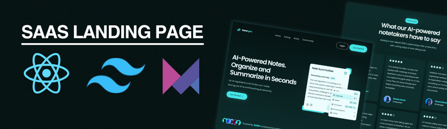

<div align="center">
  <br />
    <a href="https://bobgabule.github.io/react-note-sync/" target="_blank">
      
    </a>  
  <br />
  
  <div>
    
    
    
  </div>

  <h3 align="center">A SaaS Landing Page</h3>
</div>

## 📋 <a name="table">Table of Contents</a>

1. 🤖 [Introduction](#introduction)
2. ⚙️ [Tech Stack](#tech-stack)
3. 🔋 [Features](#features)
4. 🤸 [Quick Start](#quick-start)


## <a name="introduction">🤖 Introduction</a>

Built with React.js, styled with TailwindCSS and Framer Motion, this SaaS Landing App lets users browse the product, testimonials & FAQs

## <a name="tech-stack">⚙️ Tech Stack</a>

- **[React.js](https://react.dev/reference/react)** is a JavaScript library developed by Meta for building user interfaces. It allows developers to create reusable UI components that manage their own state, leading to more efficient and predictable code. React is widely used for developing single-page applications (SPAs) due to its virtual DOM that improves performance and ease of maintenance.

- **[Tailwind CSS](https://tailwindcss.com/)** is a utility-first CSS framework that provides low-level utility classes to build custom designs without writing custom CSS, enabling rapid and responsive UI development.

- **[Framer](https://www.framer.com/)** is a popular React animation library that makes it easy to add smooth, powerful animations and transitions to your React components

- **[Vite](https://vite.dev/)** is a modern build tool that provides a fast development environment for frontend projects. It offers features like hot module replacement (HMR) and optimized builds, enhancing the development experience and performance.

**Prerequisites**

Make sure you have the following installed on your machine:

- [Git](https://git-scm.com/)
- [Node.js](https://nodejs.org/en)
- [npm](https://www.npmjs.com/) (Node Package Manager)

**Cloning the Repository**

```bash
git clone https://github.com/bobgabule/react-note-sync.git
cd react-note-sync

```

**Installation**

Install the project dependencies using npm:

```bash
npm install
```

**Running the Project**

```bash
npm run dev
```

Open [http://localhost:5173](http://localhost:5173) in your browser to view the project.

<details>
  
<summary><code>index.css</code></summary>

```css
@import url("https://fonts.googleapis.com/css2?family=DM+Sans:ital,opsz,wght@0,9..40,100..1000;1,9..40,100..1000&display=swap");
@import url("https://fonts.googleapis.com/css2?family=Bebas+Neue&display=swap");

@import "tailwindcss";

@theme {
  --color-primary: #030014;

  --color-light-100: #cecefb;
  --color-light-200: #a8b5db;

  --color-gray-100: #9ca4ab;

  --color-dark-100: #0f0d23;

  --font-dm-sans: DM Sans, sans-serif;

  --breakpoint-xs: 480px;

  --background-image-hero-pattern: url("/hero-bg.png");
}

@layer base {
  body {
    font-family: "DM Sans", serif;
    font-optical-sizing: auto;
    background: #030014;
  }

  h1 {
    @apply mx-auto max-w-4xl text-center text-5xl font-bold leading-tight tracking-[-1%] text-white sm:text-[64px] sm:leading-[76px];
  }

  h2 {
    @apply text-2xl font-bold text-white sm:text-3xl;
  }

  main {
    @apply min-h-screen relative bg-primary;
  }

  header {
    @apply sm:mt-10 mt-5;
  }

  header img {
    @apply w-full max-w-lg h-auto object-contain mx-auto drop-shadow-md;
  }
}

@layer components {
  .pattern {
    @apply bg-hero-pattern w-full h-screen bg-center bg-cover absolute z-0;
  }

  .wrapper {
    @apply px-5 py-12 xs:p-10 max-w-7xl mx-auto flex flex-col relative z-10;
  }

  .trending {
    @apply mt-20;

    & ul {
      @apply flex flex-row overflow-y-auto gap-5 -mt-10 w-full hide-scrollbar;
    }

    & ul li {
      @apply min-w-[230px] flex flex-row items-center;
    }

    & ul li p {
      @apply fancy-text mt-[22px] text-nowrap;
    }

    & ul li img {
      @apply w-[127px] h-[163px] rounded-lg object-cover -ml-3.5;
    }
  }

  .search {
    @apply w-full bg-light-100/5 px-4 py-3 rounded-lg mt-10 max-w-3xl mx-auto;

    & div {
      @apply relative flex items-center;
    }

    & img {
      @apply absolute left-2 h-5 w-5;
    }

    & input {
      @apply w-full bg-transparent py-2 sm:pr-10 pl-10 text-base text-gray-200 placeholder-light-200 outline-hidden;
    }
  }

  .all-movies {
    @apply space-y-9;

    & ul {
      @apply grid grid-cols-1 gap-5 xs:grid-cols-2 md:grid-cols-3 lg:grid-cols-4;
    }
  }

  .movie-card {
    @apply bg-dark-100 p-5 rounded-2xl shadow-inner shadow-light-100/10;

    & img {
      @apply rounded-lg h-auto w-full;
    }

    & h3 {
      @apply text-white font-bold text-base line-clamp-1;
    }

    & .content {
      @apply mt-2 flex flex-row items-center flex-wrap gap-2;
    }

    & .rating {
      @apply flex flex-row items-center gap-1;
    }

    & .rating img {
      @apply size-4 object-contain;
    }

    & .rating p {
      @apply font-bold text-base text-white;
    }

    & .content span {
      @apply text-sm text-gray-100;
    }

    & .content .lang {
      @apply capitalize text-gray-100 font-medium text-base;
    }

    & .content .year {
      @apply text-gray-100 font-medium text-base;
    }
  }
}

@utility text-gradient {
  @apply bg-linear-to-r from-[#D6C7FF] to-[#AB8BFF] bg-clip-text text-transparent;
}

@utility fancy-text {
  -webkit-text-stroke: 5px rgba(206, 206, 251, 0.5);
  font-size: 190px;
  font-family: "Bebas Neue", sans-serif;
}

@utility hide-scrollbar {
  -ms-overflow-style: none;
  scrollbar-width: none;

  &::-webkit-scrollbar {
    display: none;
  }
}
```

</details>
